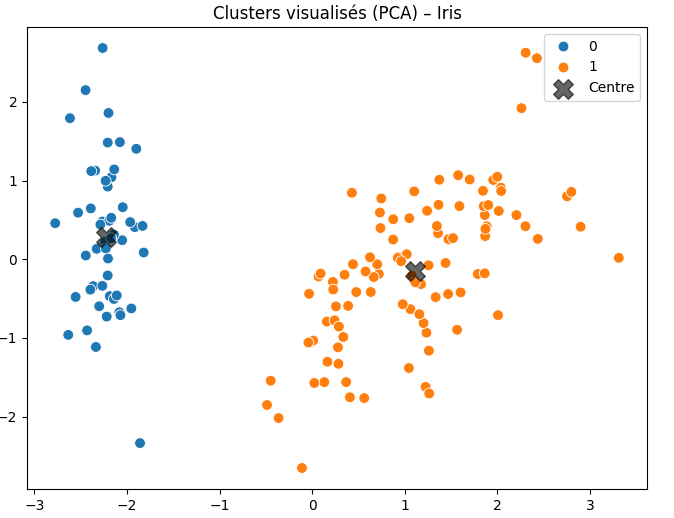
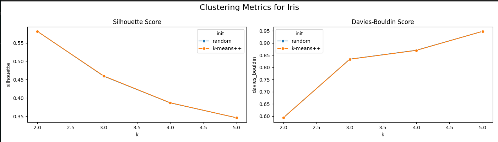
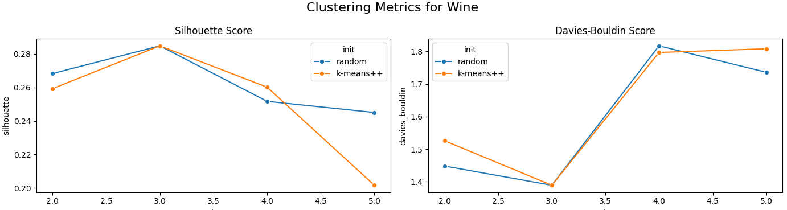
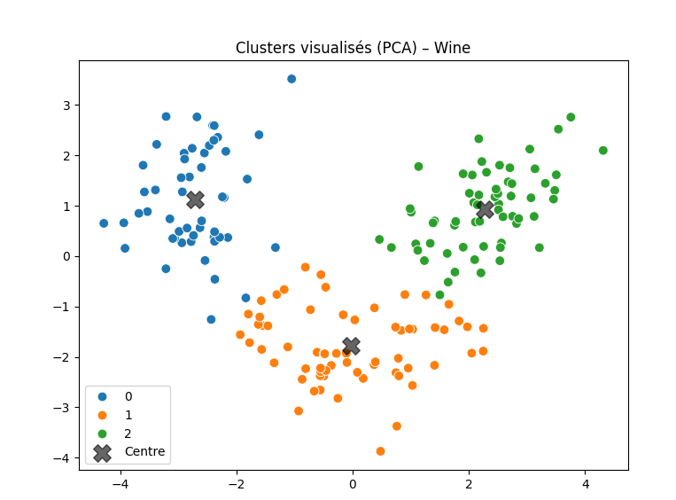
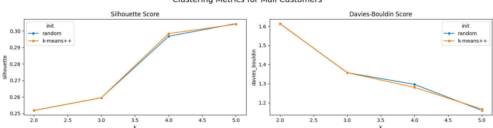
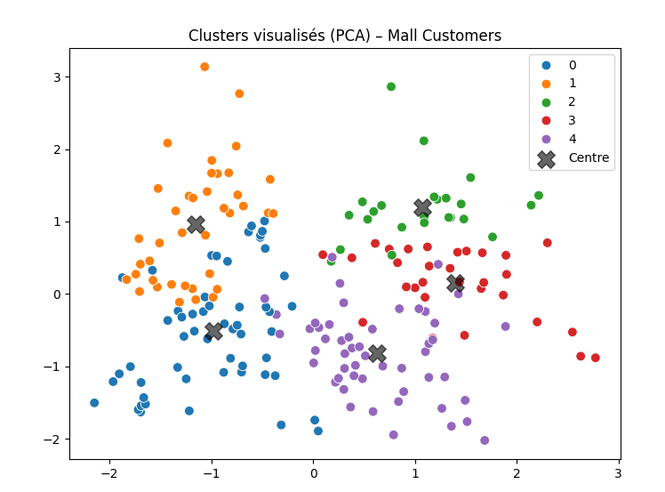
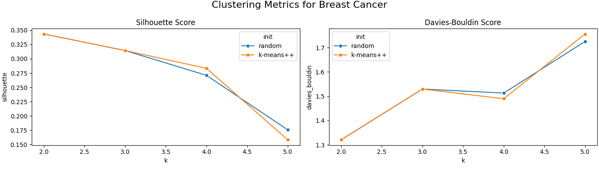
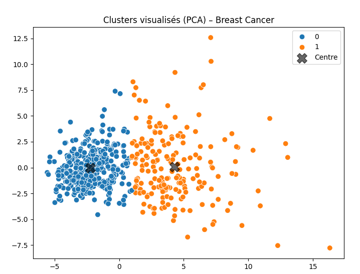

## 🟢 Dataset 1 : **Iris**

### Résultats :

| init      | k | silhouette | davies\_bouldin |
| --------- | - | ---------- | --------------- |
| random    | 2 | 0.582      | 0.593           |
| random    | 3 | 0.459      | 0.834           |
| random    | 4 | 0.387      | 0.870           |
| random    | 5 | 0.346      | 0.948           |
| k-means++ | 2 | 0.582      | 0.593           |
| k-means++ | 3 | 0.460      | 0.834           |
| k-means++ | 4 | 0.387      | 0.870           |
| k-means++ | 5 | 0.346      | 0.948           |

### Analyse :

* **k = 2** donne le **meilleur compromis** avec le **silhouette score le plus élevé** (≈ 0.582) et le **Davies-Bouldin le plus faible** (≈ 0.593).
* Les résultats sont très similaires entre `random` et `k-means++`.
* Features utilisées(4) :
 sepal length (cm),
 sepal width (cm),
 petal length (cm),
 petal width (cm)
---

## 🟣 Dataset 2 : **Wine**

### Résultats :

| init      | k | silhouette | davies\_bouldin |
| --------- | - | ---------- | --------------- |
| random    | 2 | 0.268      | 1.448           |
| random    | 3 | 0.285      | 1.389           |
| random    | 4 | 0.252      | 1.817           |
| random    | 5 | 0.245      | 1.736           |
| k-means++ | 2 | 0.259      | 1.526           |
| k-means++ | 3 | 0.285      | 1.389           |
| k-means++ | 4 | 0.260      | 1.797           |
| k-means++ | 5 | 0.202      | 1.808           |

### Analyse :

* **k = 3** est le meilleur choix, avec un **silhouette** de **0.285** et un **Davies-Bouldin** de **1.389**.
* Ce résultat est **cohérent** avec le fait que Wine contient **3 classes réelles**.
* `k-means++` et `random` donnent ici des **résultats identiques** pour k=3, montrant une certaine robustesse du clustering.
* Features utilisées(13) :
 alcohol, malic_acid, ash, alcalinity_of_ash, magnesium, total_phenols, flavanoids, nonflavanoid_phenols, proanthocyanins, 
 color_intensity, hue, od280/od315_of_diluted_wines, proline
* ces caractéristiques chimiques décrivent la composition de vins de 3 cépages différents.

---

## 🟡 Dataset 3 : **Mall Customers**

### Résultats :

| init      | k | silhouette | davies\_bouldin |
| --------- | - | ---------- | --------------- |
| random    | 2 | 0.252      | 1.614           |
| random    | 3 | 0.260      | 1.357           |
| random    | 4 | 0.297      | 1.296           |
| random    | 5 | 0.304      | 1.160           |
| k-means++ | 2 | 0.252      | 1.614           |
| k-means++ | 3 | 0.260      | 1.357           |
| k-means++ | 4 | 0.298      | 1.281           |
| k-means++ | 5 | 0.304      | 1.167           |

### Analyse :

* **k = 5** est le **meilleur choix**, avec :

  * un **silhouette** score de **0.304**
  * un **Davies-Bouldin** de **1.160** (plus faible que pour k=4 ou k=3)
* Ce résultat est **logique**, car on peut segmenter les clients selon plusieurs profils (revenu, dépense, âge...).
* `k-means++` améliore légèrement la stabilité des scores.
* Features utilisées(3) :
 Age : Âge du client en années ,
 Annual Income (k$) : Revenu annuel du client en milliers de dollars ,
 Spending Score (1-100) : Score attribué par le centre commercial, en fonction du comportement d’achat et de ses habitudes de consommation, sur une échelle de 1 à 100,

---

## 🟣 Dataset 4 : **Breast Cancer**

### Résultats :

| init      | k | silhouette | davies\_bouldin |
| --------- | - | ---------- | --------------- |
| random    | 2 | 0.343      | 1.321           |
| random    | 3 | 0.314      | 1.529           |
| random    | 4 | 0.271      | 1.513           |
| random    | 5 | 0.176      | 1.725           |
| k-means++ | 2 | 0.343      | 1.321           |
| k-means++ | 3 | 0.314      | 1.529           |
| k-means++ | 4 | 0.283      | 1.489           |
| k-means++ | 5 | 0.158      | 1.756           |

### Analyse :

* **k = 2** donne ici les **meilleurs scores** (Silhouette = 0.343, DB = 1.321).
* Cela correspond au fait que le dataset contient 2 classes principales : bénin et malin.
* `k-means++` et `random` donnent des résultats très proches.
* Features utilisées(30) :
 Ex. : mean radius, mean texture, mean perimeter, mean area, mean smoothness, etc.

---

## ✅ Conclusion générale

| Dataset        | k optimal | Initialisation recommandée   |
| -------------- | --------- | ---------------------------- |
| Iris           | 2         | random / k-means++           |
| Wine           | 3         | random / k-means++           |
| Mall Customers | 5         | k-means++ (légèrement mieux) |
| Breast Cancer  | 2         | random / k-means++           |

### Synthèse :

* Le **meilleur k** varie selon les datasets, mais les **métriques Silhouette (à maximiser)** et **Davies-Bouldin (à minimiser)** donnent des **résultats cohérents**.
* L'initialisation **`k-means++`** est **plus stable** et **souvent légèrement meilleure**, mais pas toujours.
* **La méthode du coude n’est pas indispensable** ici grâce aux bonnes performances de ces deux métriques.

